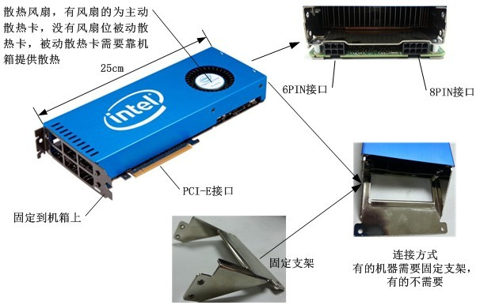

# MIC
MIC基于X86架构，支持多种并行模型，OpenMP、pThread、OpenCL、MPI等并行编程语言，采用C、C++和Fortran三种语言进行软件移植开发，特点以编程简单（引语方式）著称，工具链丰富。
MIC基于X86架构，是众核协处理器，MIC为Xeon Phi产品的架构总称，Xeon Phi的第一代产品的架构代号为“Knights Corner”。Knights Corner采用Intel 2012开始使用的3D“三门”晶体管技术，使用22nm工艺制造，MIC卡含有50个以上的核，每个核可以支持4个线程，双精性能超过1TFlops，含有512bit的向量宽度，支持8个双通道GDDR内存控制器，内存大小为6GB或8GB。

>CSDN原文链接：https://blog.csdn.net/zhang0311/article/details/8971679

